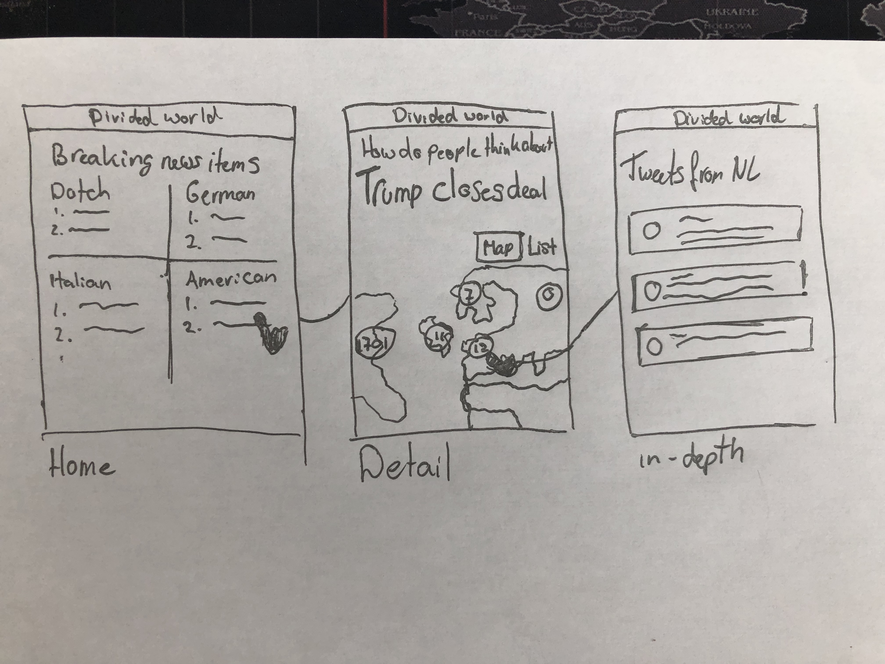
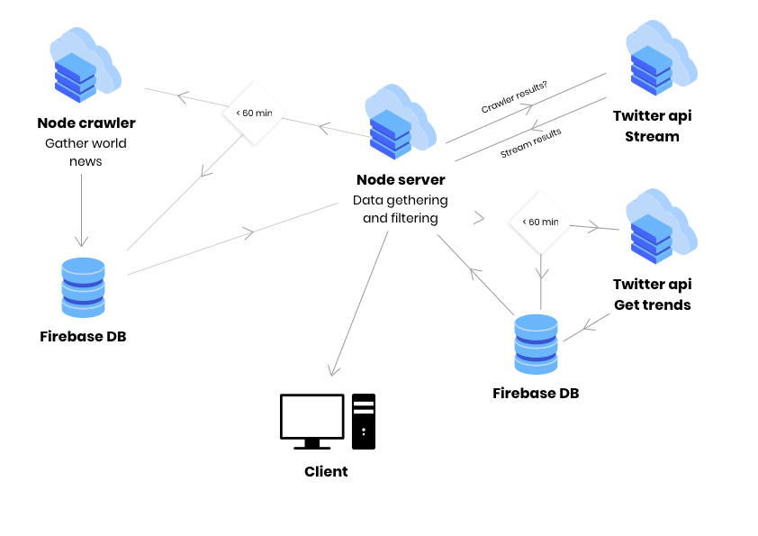

# Real-Time Web @cmda-minor-web · 2018-2019

In this subject I am going to focus on creating a fun and meaninfull application that uses realtime actions to interact between multiple instances.

link: [https://rtw-1819.herokuapp.com/](https://rtw-1819.herokuapp.com/)

## Week 1

In the first week, I created the basic message app quite fast. So I challenged myself and started with creating multiple users that could move around on the canvas. The current state is that it detects the current position of the users and on collision
there will be an alert or console log with the message "you won". So what it essentialy does is detect if two players are in the same place and returns a collision statement. Howover, this is not very good practice as you cannot know who collide with who and there is currently no way to detect the angle of impact for some sort of bounce effect. To tackle this I need to work with 2d vectors and libraries like victor.js and get deeper into the physics of game development.

## Week 2
In this week it was all about creating a new concept and to continue building something awesome.

### Concept
The concept I came up with, after the presentation of Laurens on tuesday, is to locate the opinion of people on breaking news items around the world. To achieve this, I gather multiple news sources over the world and connect them to hashtags on twitter of rising topics.  
I came up with this idea based on the tragedy that happened to the Notre Dame in Paris. In europe almost everyone was very sad about what happened but from america there where tweets about justice for the slavery 400 years ago. Besides that the notre-dame was build way before the slavery era, it is interesting to see how people from different areas of the world are opinionated about breaking news.

### Api
The api that I use is the twitter api, this is a really big real-time api which gives a rich amount of content back as seen below.

<details>
  <summary>Data from the twitter API</summary>
```JSON
{ created_at: 'Fri Apr 19 09:25:21 +0000 2019',
  id: 1119170105601089500,
  id_str: '1119170105601089536',
  text: 'exactly .',
  source:
   '<a href="http://twitter.com/download/iphone" rel="nofollow">Twitter for iPhone</a>',
  truncated: false,
  in_reply_to_status_id: null,
  in_reply_to_status_id_str: null,
  in_reply_to_user_id: null,
  in_reply_to_user_id_str: null,
  in_reply_to_screen_name: null,
  user:
   { id: 1066112461550616600,
     id_str: '1066112461550616577',
     name: '␞',
     screen_name: 'S20Rahaf',
     location: '☄️',
     url: null,
     description: '"One day" OR "Day one". You decide! 👩🏽‍⚕️💉',
     translator_type: 'none',
     protected: false,
     verified: false,
     followers_count: 18,
     friends_count: 22,
     listed_count: 0,
     favourites_count: 160,
     statuses_count: 424,
     created_at: 'Fri Nov 23 23:33:13 +0000 2018',
     utc_offset: null,
     time_zone: null,
     geo_enabled: false,
     lang: 'en',
     contributors_enabled: false,
     is_translator: false,
     profile_background_color: 'F5F8FA',
     profile_background_image_url: '',
     profile_background_image_url_https: '',
     profile_background_tile: false,
     profile_link_color: '1DA1F2',
     profile_sidebar_border_color: 'C0DEED',
     profile_sidebar_fill_color: 'DDEEF6',
     profile_text_color: '333333',
     profile_use_background_image: true,
     profile_image_url:
      'http://pbs.twimg.com/profile_images/1119017008136433664/FmoA1AJx_normal.jpg',
     profile_image_url_https:
      'https://pbs.twimg.com/profile_images/1119017008136433664/FmoA1AJx_normal.jpg',
     profile_banner_url:
      'https://pbs.twimg.com/profile_banners/1066112461550616577/1555665429',
     default_profile: true,
     default_profile_image: false,
     following: null,
     follow_request_sent: null,
     notifications: null },
  geo: null,
  coordinates: null,
  place: null,
  contributors: null,
  quoted_status_id: 1116183768471982100,
  quoted_status_id_str: '1116183768471982080',
  quoted_status:
   { created_at: 'Thu Apr 11 03:38:42 +0000 2019',
     id: 1116183768471982100,
     id_str: '1116183768471982080',
     text:
      'watermelon and mango are the best fruits do not try to argue with me i know im winning https://t.co/ujSDfUtmRC',
     display_text_range: [ 0, 86 ],
     source:
      '<a href="http://twitter.com/download/android" rel="nofollow">Twitter for Android</a>',
     truncated: false,
     in_reply_to_status_id: null,
     in_reply_to_status_id_str: null,
     in_reply_to_user_id: null,
     in_reply_to_user_id_str: null,
     in_reply_to_screen_name: null,
     user:
      { id: 859343362754609200,
        id_str: '859343362754609153',
        name: '🍒 janna vasquez 🍒',
        screen_name: 'notjanna_',
        location: 'oceans',
        url: 'https://instagram.com/notjanna_',
        description: 'pretty colorful rainbow',
        translator_type: 'none',
        protected: false,
        verified: false,
        followers_count: 1055,
        friends_count: 784,
        listed_count: 2,
        favourites_count: 18617,
        statuses_count: 15879,
        created_at: 'Tue May 02 09:46:38 +0000 2017',
        utc_offset: null,
        time_zone: null,
        geo_enabled: true,
        lang: 'en',
        contributors_enabled: false,
        is_translator: false,
        profile_background_color: 'F5F8FA',
        profile_background_image_url: '',
        profile_background_image_url_https: '',
        profile_background_tile: false,
        profile_link_color: '1DA1F2',
        profile_sidebar_border_color: 'C0DEED',
        profile_sidebar_fill_color: 'DDEEF6',
        profile_text_color: '333333',
        profile_use_background_image: true,
        profile_image_url:
         'http://pbs.twimg.com/profile_images/1115867502167371778/gj9Kyipv_normal.jpg',
        profile_image_url_https:
         'https://pbs.twimg.com/profile_images/1115867502167371778/gj9Kyipv_normal.jpg',
        profile_banner_url:
         'https://pbs.twimg.com/profile_banners/859343362754609153/1554129957',
        default_profile: true,
        default_profile_image: false,
        following: null,
        follow_request_sent: null,
        notifications: null },
     geo: null,
     coordinates: null,
     place: null,
     contributors: null,
     quoted_status_id: 1115323616571351000,
     quoted_status_id_str: '1115323616571351040',
     is_quote_status: true,
     quote_count: 1870,
     reply_count: 121,
     retweet_count: 43073,
     favorite_count: 75810,
     entities:
      { hashtags: [], urls: [Array], user_mentions: [], symbols: [] },
     favorited: false,
     retweeted: false,
     possibly_sensitive: false,
     filter_level: 'low',
     lang: 'en' },
  quoted_status_permalink:
   { url: 'https://t.co/HTSfJlpf3K',
     expanded: 'https://twitter.com/notjanna_/status/1116183768471982080',
     display: 'twitter.com/notjanna_/stat…' },
  is_quote_status: true,
  quote_count: 0,
  reply_count: 0,
  retweet_count: 0,
  favorite_count: 0,
  entities: { hashtags: [], urls: [], user_mentions: [], symbols: [] },
  favorited: false,
  retweeted: false,
  filter_level: 'low',
  lang: 'en',
  timestamp_ms: '1555665921007' }
  ```

  </details>

  #### The limits
  The limits are per 15 minutes for the twitter api.  
  
  |             Request             |         Limit per 15 min          |
  | :-----------------------------: | :-------------------------------: |
  |           GET Trends            |                 75                |
  |           GET search/tweets     |                 180               |

  
  ## Views
  I have multiple views where there can be interaction with data gather from the scraper and from the twitter API.

  The screens will be as following:
  

  On the overview page there will be a list with the most interesting news per country, these can be clicked on to move to the next screen.  
  On the detail page you can see how many tweets there are over the world about this specific topic and can be clicked on to view a more in-depth about what tweets are being send.

  ## Data life cycle
  The data that I will use from twitter is their trends:
  ```JSON
  [
    {
      "name":"#DuyguAsena",
      "url":"http://twitter.com/search?q=%23DuyguAsena",
      "promoted_content":null,
      "query":"%23DuyguAsena",
      "tweet_volume":null,
      
    }
  ]
  ```

  And their tweets on certain topics, which will be a filtered stream of tweets.

  ```JSON
  [
    {
     "entities": { "hashtags": [], "urls": [], "user_mentions": [], "symbols": [] },
     "geo": null,
     "coordinates": null,
     "place": null,
     "user": {
        "screen_name": "Ashraf_021",
        "created_at": "Fri Nov 23 23:33:13 +0000 2018"
      },
      "quoted_status": {
        "text": "watermelon and mango are the best fruits do not try to argue with me i know im winning https://t.co/ujSDfUtmRC'"
      }
    }
  ]
  ```

  * More will probably follow when I get deeper into the project.


  From the scraper I get an array of objects that are scraped from different news sites. An array can look like this:
  ```JSON
  [
    {
        "site": "Guardian",
        "title": "Trump-Russia investigation",
        "subtitle": "Mueller report unable to clear Trump of obstruction of justice"
    }
  ]
```

  I Currently gather news from these sites:
  - The Guardian
  - Der Spiegel
  - The times
  - The South African, 
  - Irish times
  - Corriere (italian)
  - NU.nl


  Visualisation of my data cycle:


  ## Feedback

  I would like feedback on my data structure in combination with my concept. I think there will be an more effective way.